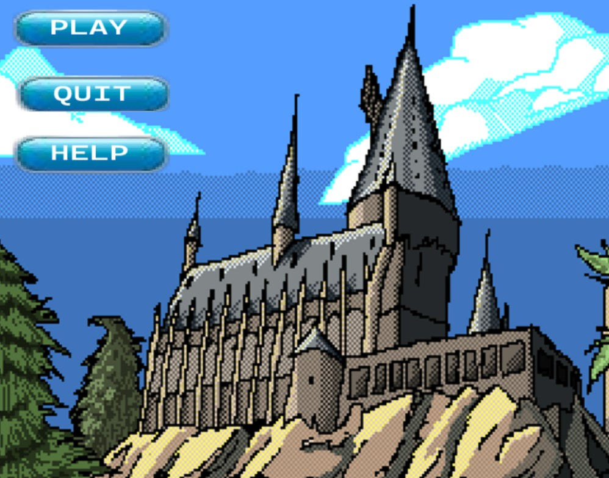
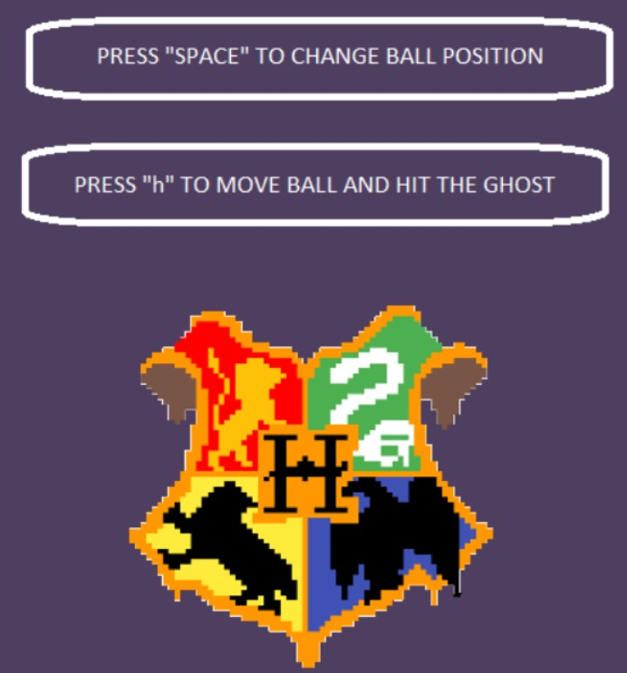
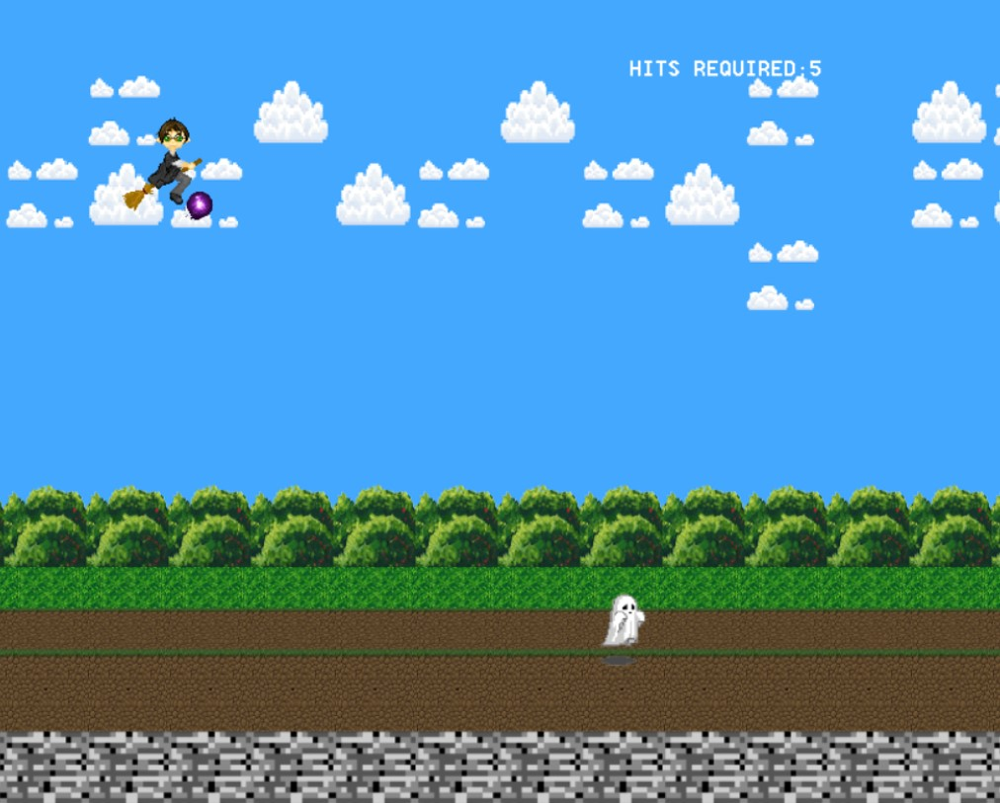

# Hogwarts 0.3 - README

## Description
Hogwarts 0.3 is a two-dimensional game developed using Object-Oriented Programming (C++) that features an interactive interface and a quest for the participant. The game utilizes an external graphics library called "Simple DirectMedia Layer (SDL)" for graphics and audio integration.

## External Libraries
This project utilizes the following external libraries:
- SDL2: [SDL Releases](https://github.com/libsdl-org/SDL/releases/tag/release-2.24.0)
- SDL2_image-2.0.1: [SDL_image Releases](https://github.com/libsdl-org/SDL_image/releases)
- SDL2_MIXER-2.0.0: [SDL_mixer Releases](https://github.com/libsdl-org/SDL_mixer/releases)
- sdl_ttf-2.20.0: [SDL_ttf Releases](https://github.com/libsdl-org/SDL_ttf/releases)

## Setup Instructions

### Prerequisites
- Microsoft Visual Studio (or any compatible IDE for C++)
- SDL libraries (downloaded from the provided links)

### Installation Steps
1. Clone or download the Hogwarts_0.3 project folder.
2. Open your Microsoft Visual Studio.
3. Include the Hogwarts_0.3 folder in your project directory.
4. Set the project properties to All Platforms.
5. Add the include files of all the SDL libraries to the project properties (C/C++).
6. Include the additional library directories in the linker section of the project properties.
7. Add the additional dependencies: Name of the .lib files of all the SDL libraries.
8. Place the .dll files (Dynamic Link Library) in the game folder containing the Visual Studio solution file.

## Usage
1. Open the Hogwarts_0.3 solution in Microsoft Visual Studio.
2. Build and run the project to play the game.
3. Follow the on-screen instructions.

## Contributing
If you would like to contribute to the Hogwarts 0.3 project, please follow these steps:
1. Fork the repository.
2. Make your changes.
3. Submit a pull request detailing your changes.

## Game Screenshots

